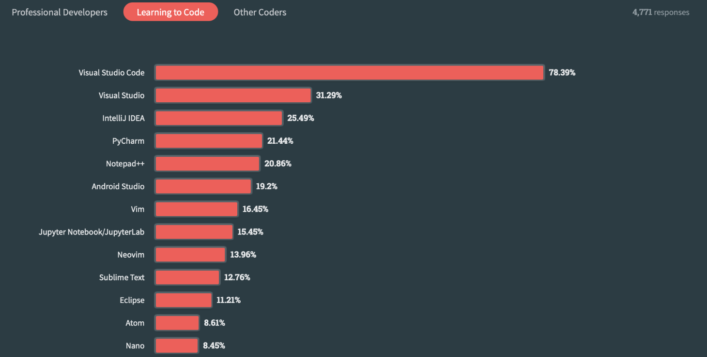

# Getting Started with VSCode for Data Science

## Introduction

Welcome to the world of data science, a field where we turn data into insights and knowledge. This beginner's guide is designed to introduce you to Visual Studio Code (VSCode), a powerful tool for data science. We'll walk you through setting up VSCode, using Jupyter notebooks, and getting started with a data science project.

## Ways to Run Python Code

In data science, Python can be executed in various ways, each suited for different needs:

### 1. Python Interpreter (Command Line)
- **Interactive Shell:** Run `python` or `python3`.
- **Script Execution:** Run scripts with `python filename.py`.

### 2. Integrated Development Environments (IDEs)
- **Examples:** PyCharm, VSCode, Eclipse.
- **Features:** Code completion, debugging, more.

### 3. Text Editors with Python Support
- **Examples:** Sublime Text, Atom.
- **Features:** Syntax highlighting, basic execution.

### 4. Jupyter Notebooks
- **Usage:** Interactive documents with live code.
- **Execution:** Run code cells independently.

### 5. Online Python Interpreters and IDEs
- **Examples:** Repl.it, Google Colab.
- **Convenience:** Code in a web browser.

## Introduction to VSCode

- **About:** VSCode is a free, lightweight code editor by Microsoft.
- **Features:** It supports various languages, including Python.

## What is Jupyter Notebook?

Jupyter combines Markdown and Python code in an interactive notebook.

### Key Points:

- **Usage**: Ideal for data science and machine learning.
- **Features**: Interactive computing, data visualization, more.

You can use Jupyter Notebooks within VSCode for data science.

## Setting Up VSCode

### Step 1: Install Visual Studio Code

- Download VSCode from [this link](https://code.visualstudio.com/).

### Step 2: Install Python and Other Extensions

- In VSCode, go to Extensions and install `Python`, `Jupyter`, `Pylance`, and `IntelliCode`.

### Step 3: Open or Create a Jupyter Notebook

- Use the Command Palette (`Ctrl+Shift+P`) and type `Jupyter: Create New Blank Jupyter Notebook`.
- Open an existing `.ipynb` file or create a new one.

### Step 4: Select a Kernel

- Select a kernel in the top right corner.
- The language picker updates automatically.

### Step 5: Run Notebook Cells

- Write Python code in a cell.
- Use `Shift+Enter` to run the cell.

## Save and Export Your Jupyter Notebook

- Save with `Ctrl+S`.
- Export as Python, PDF, or HTML.

## Starting a Data Science Project

### Step 6: Create and Open a Project Folder

- Create a new folder.
- Open it in VSCode (`File > Open Folder`).

### Step 7: Explore Data

- Create and explore data in a Jupyter notebook.

### Step 8: Save and Share Your Work

- Save regularly.
- Share your `.ipynb` files or upload to GitHub.

## Additional Resources

- [VS Code for Data Science & AI Video](https://www.youtube.com/watch?v=zulGMYg0v6U)
- [12 Essential VSCode Extensions for Data Science](https://www.kdnuggets.com/2022/07/12-essential-vscode-extensions-data-science.html)
- [Official VSCode Data Science Documentation](https://code.visualstudio.com/docs/datascience/overview)
